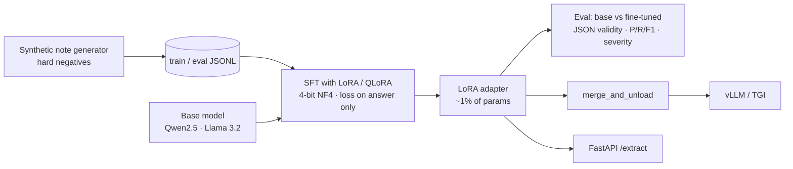

# clinical-ade-qlora

**A QLoRA fine-tuning pipeline that teaches a small open LLM (Qwen2.5 / Llama 3.2) to pull adverse drug events out of clinical notes as structured, schema-validated JSON.**

```
Note:   "58-year-old male seen for follow-up. Current medications: lisinopril, metformin.
         Denies nausea. Patient reports persistent dry cough since starting lisinopril."
Output: {"events": [{"drug": "lisinopril", "reaction": "dry cough", "severity": "moderate"}]}
```

Pharmacovigilance teams read a lot of free text to find ADEs. General-purpose chat models will do this if you prompt them, but they tend to drift from the output schema and extract symptoms the note actually rules out ("Denies nausea"). A small model fine-tuned on the task is cheaper to run, can be hosted inside a HIPAA boundary, and follows the schema consistently. This repo is the whole loop, end to end:



## What's in it

| piece | details |
|---|---|
| **Data** | Deterministic synthetic generator: 15 drugs with their known reactions, three severity levels mapped from cue words and outcomes ("requiring an ED visit"), 0-3 events per note. It also includes **hard negatives**: denied symptoms, symptoms put down to another cause, symptoms that predate the drug, and resolved ones. There is no patient data, so the dataset can be shared and regenerated. |
| **Training** | Plain HF `Trainer` plus PEFT. 4-bit NF4 with double quantisation and a paged 8-bit AdamW when a GPU is available. The prompt is **masked with `-100`**, so loss is computed only on the JSON answer, and truncation never cuts into the answer. Uses the model's chat template when it has one. |
| **Config** | Typed YAML (pydantic) under `configs/`: Qwen2.5-1.5B (fits a free T4), Llama-3.2-3B, and a tiny CPU config. |
| **Evaluation** | Generation-based, not just loss. Measures JSON/schema validity, event-level precision, recall and F1 on (drug, reaction) pairs, severity accuracy, exact-match rate, and accuracy on notes with **no** ADE (the false-positive trap). Runs base and fine-tuned models on the same split and writes a before/after table. |
| **Serving** | FastAPI `/extract` with base + adapter, or `ade-ft merge` for adapter-free serving on vLLM/TGI. Dockerfile included. |
| **Tests / CI** | 18 tests, including an **end-to-end smoke test** that trains, evaluates, and serves a tiny random Llama on CPU with no downloads, so the whole pipeline runs in GitHub Actions. |

## Run it on a GPU (free Colab T4 works)

```bash
pip install -e ".[gpu,dev,serve]"
make data                                        # 2,000 train / 200 eval notes
make train   CONFIG=configs/qwen2.5-1.5b-qlora.yaml
make compare CONFIG=configs/qwen2.5-1.5b-qlora.yaml   # writes outputs/.../eval/comparison.md
make serve   CONFIG=configs/qwen2.5-1.5b-qlora.yaml
curl -s localhost:8000/extract -H 'content-type: application/json' \
  -d '{"note":"Patient reports severe tendon pain since starting ciprofloxacin, requiring the drug to be stopped."}'
```

Or open **`notebooks/colab_qlora_t4.ipynb`**, which does clone → train → compare in one go.

`compare` writes a `| metric | base | fine-tuned | delta |` table covering every metric below to `comparison.md`, plus the raw generations (`*.predictions.jsonl`) for error analysis.

## Run it on a laptop (no GPU, no downloads)

```bash
pip install -e ".[dev]"
make test     # 18 tests, ~10 s
make smoke    # full data -> train -> compare on a tiny random Llama, ~2 min on CPU
```

`make smoke` builds a 141K-parameter random Llama with a BPE tokenizer trained locally, then trains LoRA adapters on it. The actual result:

| metric | base | fine-tuned |
|---|---|---|
| json_valid_rate | 0.000 | **0.995** |
| f1 | 0.000 | 0.000 |

That's the result you'd expect, and it's a useful sanity check. The adapter learns the **output format** perfectly but can't learn the task, because a random base model knows nothing about language. The eval exists to separate "it outputs valid JSON" from "it gets the right answer." A real pretrained base is what closes that gap.

## Design notes

- **Why loss-masking?** Without it, most of the gradient goes into reproducing the long instruction and note, and very little into the short JSON answer.
- **Why generation-based eval?** Eval loss can keep improving while the model still produces invalid JSON or hallucinated events. Downstream metrics are what matter.
- **Why hard negatives?** Negation ("denies nausea") is the most common way ADE extractors go wrong. Having `empty_note_accuracy` as its own metric makes it hard to miss.
- **QLoRA fallback.** On CPU, or without `bitsandbytes`, the loader logs a warning and trains full-precision LoRA, so the same code runs on any machine.
- **transformers 5.x compatible.** Warmup is computed as steps, since `warmup_ratio` was removed.

## Layout

```
src/ade_ft/
  data.py       synthetic generator, prompt building, label masking, collator
  schema.py     instruction, pydantic output schema, robust JSON parsing
  config.py     typed YAML config
  model.py      4-bit loading, LoRA attach, trainable-param summary
  train.py      Trainer loop, adapter save
  evaluate.py   batched greedy generation, P/R/F1, severity, comparison table
  serve.py      FastAPI /extract
  tiny.py       tiny random Llama + local tokenizer for offline tests
  cli.py        ade-ft gen-data | train | compare | merge
configs/        qwen2.5-1.5b · llama3.2-3b · tiny-cpu
notebooks/      Colab T4 walkthrough
```

> The data is synthetic and meant for demonstration. It isn't medical advice, and a model trained on it is not a validated pharmacovigilance tool.

## License

MIT
